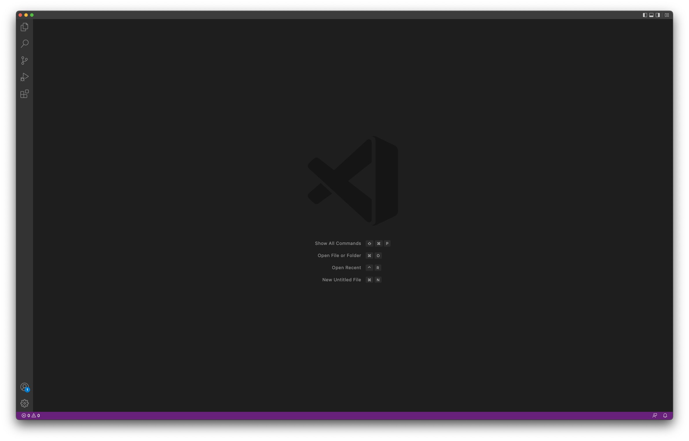
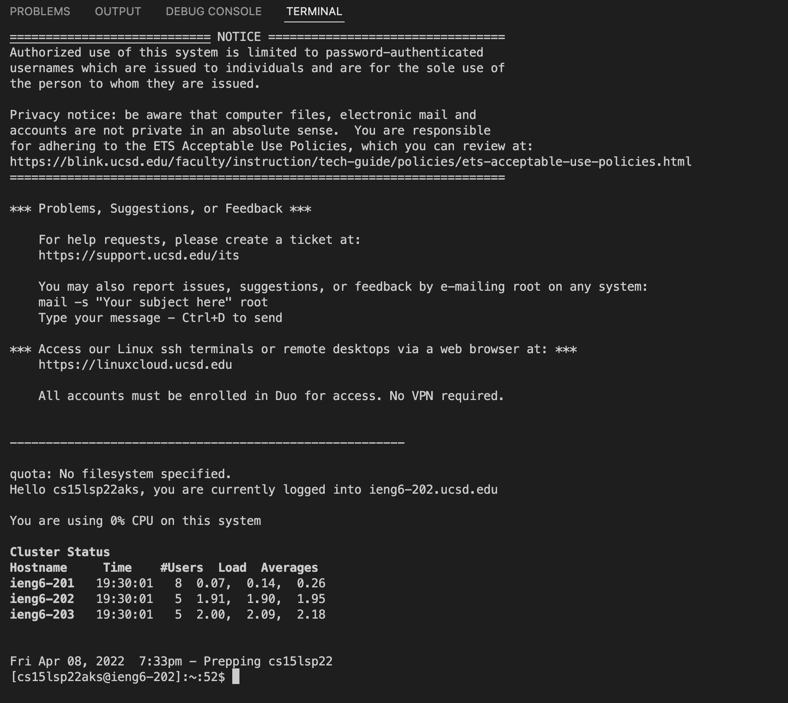

# Week 2 Lab Report (1)
### Introduction
On this page, you will be guided step-by-step on how to remotely access your ieng account on your local device. The steps are as follows:
1. Installing VScode
2. Remotely Connecting
3. Trying Some Commands
4. Moving Files with scp
5. Setting an SSH Key
6. Optimizing Remote Running

### 1. Installing Visual Studio Code (VSCode)
The first step is to visit the [official VSCode website](https://code.visualstudio.com/) and download VSCode onto your device.
Click the "Download" button for your operating system.

After downloading, make sure that it opens to a page similar to the one below.

### 2. Remotely Connecting
Windows users have a prestep: which is to download [OpenSSH](https://docs.microsoft.com/en-us/windows-server/administration/openssh/.openssh_install_firstuse).

Students will have to look up their account on the [SDACS](https://sdacs.ucsd.edu/~icc/index.php) site.

On VSCode, open up a terminal and type the following command, replacing zz with your specific id.

`$ ssh cs15lsp22zz@ieng6.ucsd.edu`

If it is your first time connecting, you will receive a message asking if you want to connect. Say yes, and then it will prompt you to put in your password. Afterwards, you should be logged into the server remotely.
When logged in, you should see something along these lines:


### 3. Trying Some Commands
Here are some commands to try. Make sure to test them both on your local device as well as while connected to the server.
```
* cd ~
* cd
* ls -lat
* ls -a
* ls <directory> where <directory> is /home/linux/ieng6/cs15lsp22/cs15lsp22abc, where the abc is one of the other group members’ username
* cp /home/linux/ieng6/cs15lsp22/public/hello.txt ~/
* cat /home/linux/ieng6/cs15lsp22/public/hello.txt
(Copied directly from the Lab 1)
```
Here is an example of some commands:

To exit, use the "exit" command.

### 4. Moving files with scp
In order to move files from our local device into the server, you first need a file. For this example, it is recommended to create a file with the following contents:
```
class WhereAmI {
  public static void main(String[] args) {
    System.out.println(System.getProperty("os.name"));
    System.out.println(System.getProperty("user.name"));
    System.out.println(System.getProperty("user.home"));
    System.out.println(System.getProperty("user.dir"));
  }
}
```
This file helps us determine if it has been copied.

We will be using the scp command, always running it on the client computer. This means it is from the local computer, so you do not log into your ieng6 account.
When running this file using javac and java on the local computer, it shows information about the computer it is being run on(your computer information!).

Now, using the command
```
scp WhereAmI.java cs15lsp22zz@ieng6.ucsd.edu:~/
```
you can copy your file into the server. It will ask you to enter your password. After, log into your ieng6 account using ssh, and use ls to check it is there. You should see something along these lines.

After, run it using javac and java again. Notice the difference? Because it is being run from the server, the contents of the file that is printed is different.
### 5. Setting an SSH Key
There is an inconvenience of logging in with a password every time you want to access the server, but we can bypass this by creating a keygen. The command to use is as follows:
```
$ ssh-keygen
```
When it asks for a file, type the following (replace &lt;user-name&gt; with your user name on the computer):
```
/Users/<user-name>/.ssh/id_rsa
```
Afterwards, enter an empty passphrase (just click enter). Now, log into the server using ssh and do the following:
```
$ mkdir .ssh
$ <logout>
# back on client
$ scp /Users/<user-name>/.ssh/id_rsa.pub cs15lsp22zz@ieng6.ucsd.edu:~/.ssh/authorized_keys
```
Now, you can log in and copy without the password.
It should look something like this:

As you can see, I logged in without typing a password!

### 6. Optimizing Remote Running
You can write multiple lines of code on a singular line. To write code within "" in order to run it immediately after the ssh command. You can also write multiple commands at once by following one command with ;.
One example of very efficient code is as follows:
