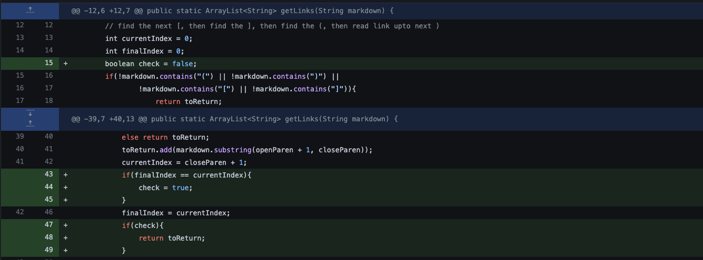

# Week 4 Lab Report (2)
### Bug 1: Infinite looping when there is an extra return in the end of the file

[Link](https://github.com/AusJung/markdown-parser/blob/f90aaec6a7b34d30eae902f7f6d46fa29d88d44e/test-file.md) to file that caused problems

Above is what the error showed on the terminal.

The symptom is an infinite loop that doesn't allow the program to end. This is because there is a bug in our code that does not check for what to do when there is a faulty input. The input has an extra return, which does not update the current index to the final index, which makes the program stuck.
### Bug 2: String Index out of Bounds Exception

[Link](https://github.com/AusJung/markdown-parser/blob/fbcde334833139f4a57d753f102d18daea533ced/test-file4.md) to file that caused problems

Above is what the error showed on the terminal.

The symptom is an index out of bounds that doesn't allow the program to end. This is because there is a bug in our code that does not know what to do when there is no parenthesis. The program did not know what to do because it could not find the parenthesis in the input. 
### 2. Bug 3: () instead of []

[Link](https://github.com/AusJung/markdown-parser/blob/fbcde334833139f4a57d753f102d18daea533ced/test-file3.md) to file that caused problems

Above is what the error showed on the terminal.

The failure inducing input contains a space after the bracket which is considered a faulty input from our code. The code that is printed is the symptom, which shows the text in parenthesis instead of brackets.