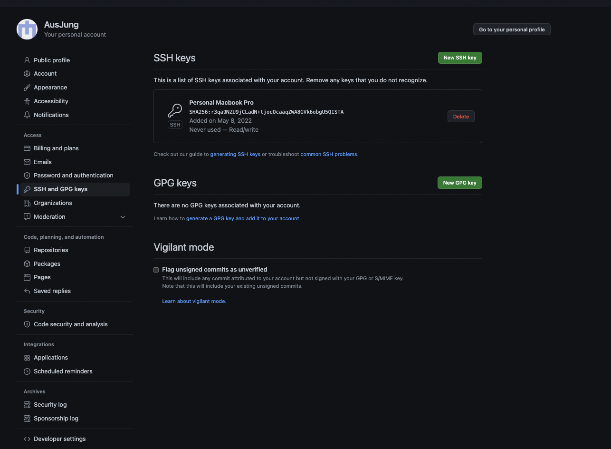
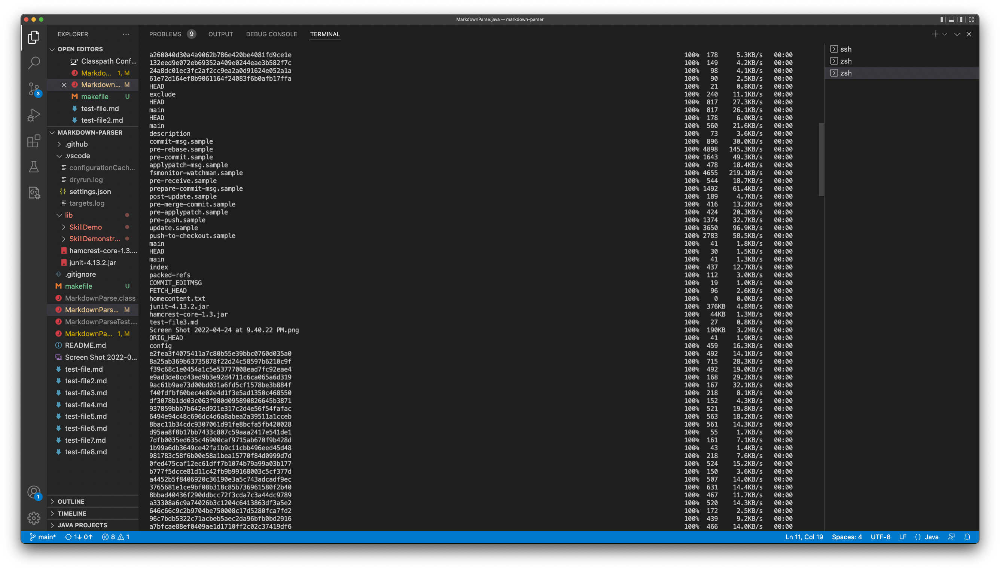

# Week 6 Lab Report (3)
### Streamlining ssh Configuration
In the terminal, type the code `vim ~/.ssh/config`. This creates a new file using vim, which you can edit to include the following code:


Then when I type the command `ssh ieng6`, I can log into the server very easily.


To show that it worked, I decided to copy my anything.md file into the server, by using `scp file alias`. I then logged into the server and used the ls command to see that anything.md was succesfully copied.


### Setup Github Access from ieng6
For this section, I followed the instructions from the [github article](https://docs.github.com/en/authentication/connecting-to-github-with-ssh/adding-a-new-ssh-key-to-your-github-account) that describes how to add a new SSH key to your GitHub Account. I followed the directions and copied and pasted my key to the github account.

Here is the file location for private key:

Below is me using git add and commit on the ieng6 server. I added a couple comments to the MarkdownParse.java file.


Here is the [link](https://github.com/AusJung/markdown-parser/commit/82860bfd429d1bcbf05b28f00963352e4c636c06) to the commit.

### Copy whole directories with `scp -r`
Here is me copying the whole directory of MarkdownParser into the ieng6 server.




Below is me compiling MarkdownParseTest.java and then running it in the ieng6 server.

By using the command 
```
$ scp -r *.java *.md lib/ ieng6:markdown-parse; ssh ieng6 "cd markdown-parse; /software/CSE/oracle-java-17/jdk-17.0.1/bin/javac -cp .:lib/junit-4.13.2.jar:lib/hamcrest-core-1.3.jar MarkdownParseTest.java; /software/CSE/oracle-java-17/jdk-17.0.1/bin/java -cp .:lib/junit-4.13.2.jar:lib/hamcrest-core-1.3.jar org.junit.runner.JUnitCore MarkdownParseTest"   
```
I was able to do all of the commands in one line of code, with the outcome shown below:


Note: I did not show the entire output of the line of code, as I showed it previously earlier. I decided to cut out the middle part which showed more of the copying of the file into the server.