# Week 8 Lab Report (4)
## Links to repositories:
[Here](https://github.com/AusJung/markdown-parser-main-2) is the link to my markdown-parse repository.

[Here](https://github.com/Pgerardocastaneda/markdown-parser) is the link to the markdown-parse repository of the person I reviewed

### Snippet 1
The VSCode preview shows that Snippet 1 should have the expected output:

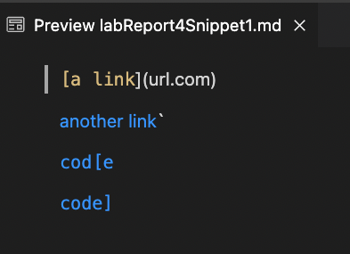

Here is the code I wrote in `MarkdownParseTest.java`, along with it running and testing succesfully.

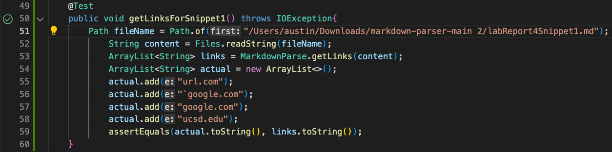

As shown above, my test passed properly. Here is an image of the green checkmark being a little bigger.

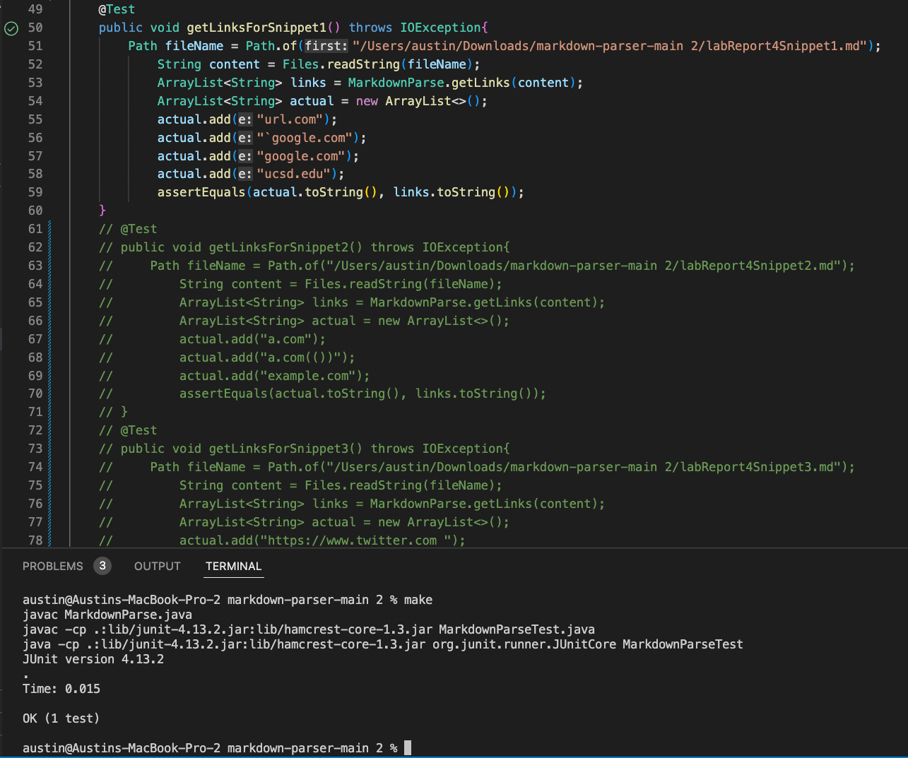

For the implementation I reviewed in Week 7, it also passed for the first md file.

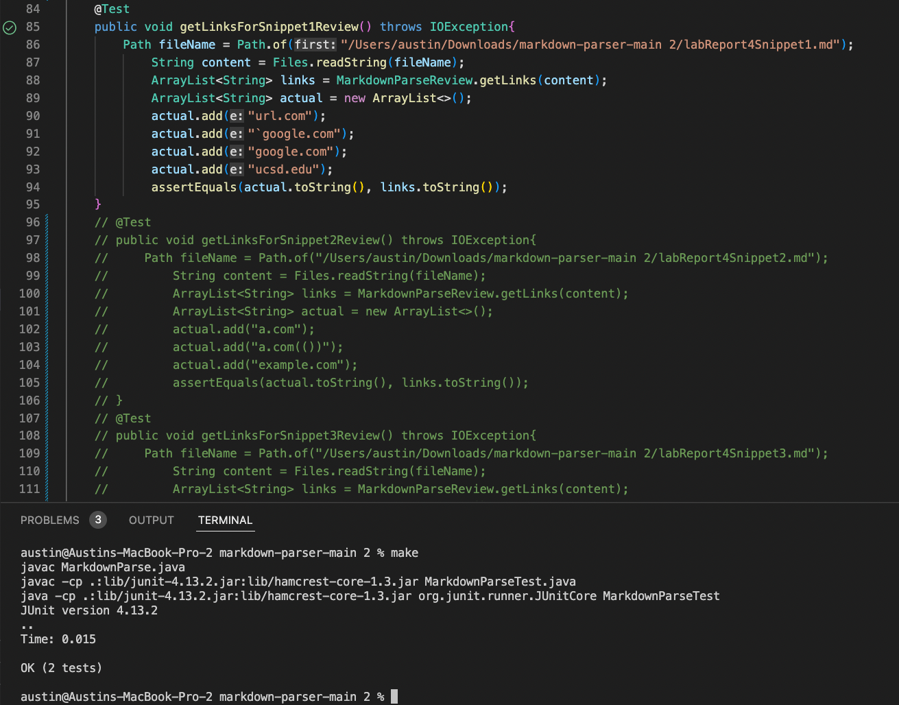

### Snippet 2
The VSCode preview shows that Snippet 2 should have the expected output:

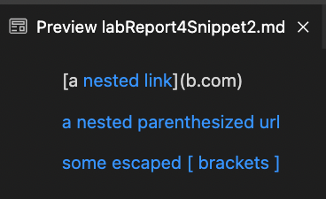

Here is the code I wrote in `MarkdownParseTest.java`.

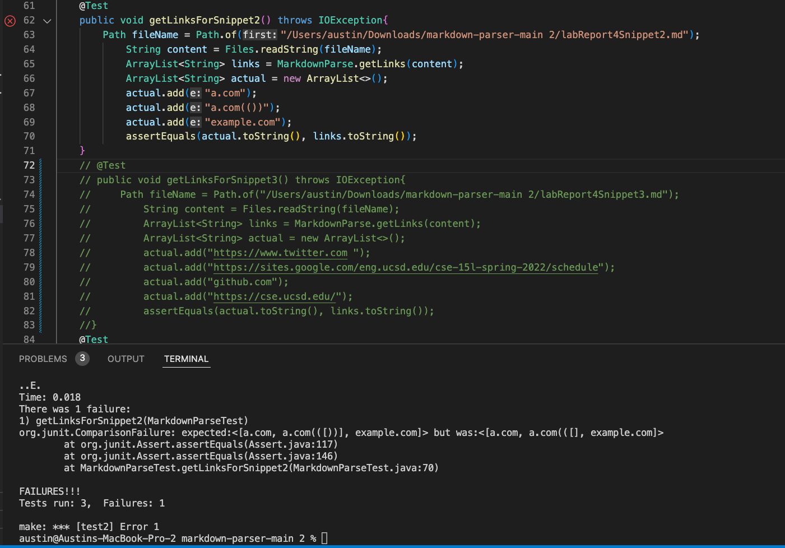

As you can see above, it did not pass my test. Here is a more clear image of the error that it ran through when running. 

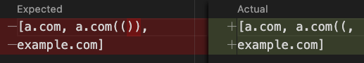

For the implementation I reviewed in Week 7, it also did not pass for the second md file.

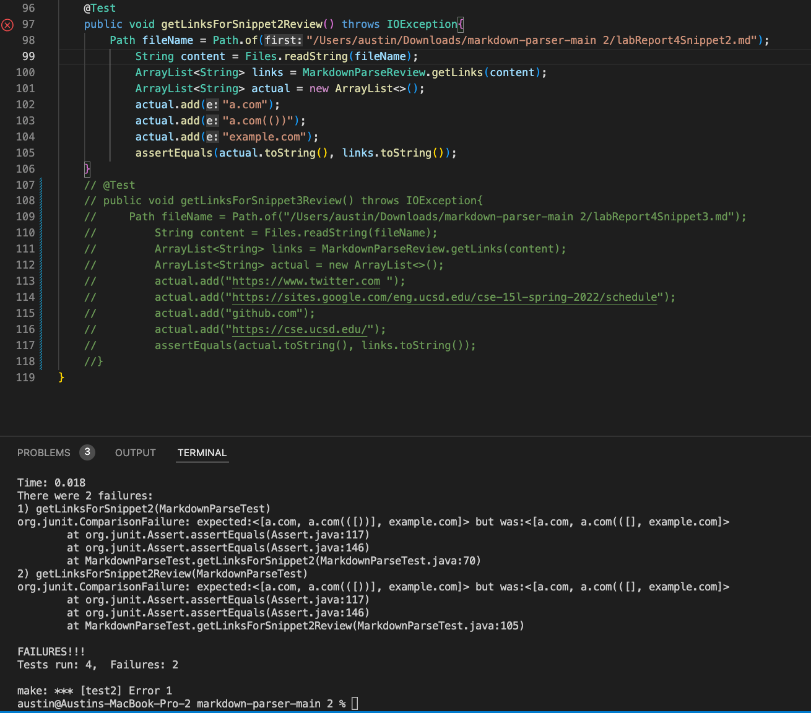

### Snippet 3
The VSCode preview shows that Snippet 3 should have the expected output:

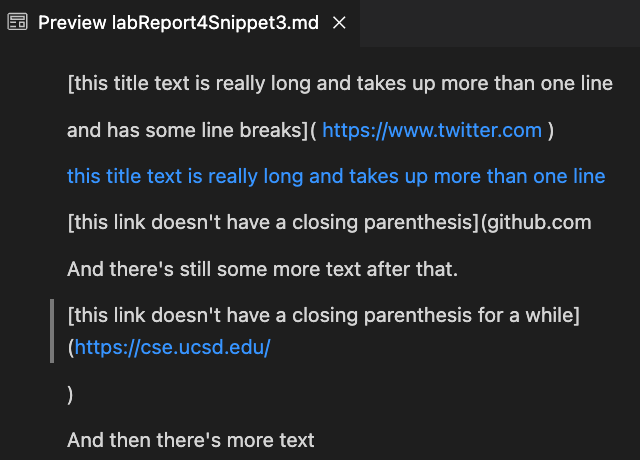

Here is the code I wrote in `MarkdownParseTest.java`.

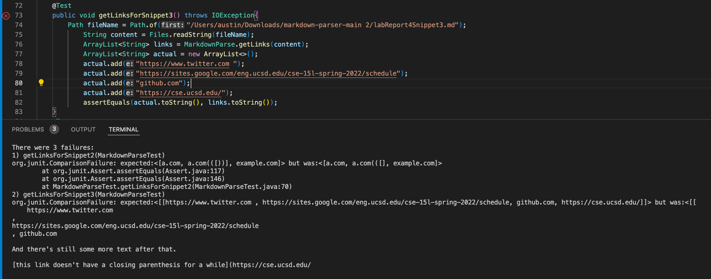

As you can see above, it did not pass my test. Here is a more clear image of the error that it ran through when running. 

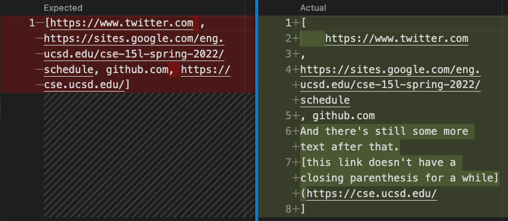

For the implementation I reviewed in Week 7, it also did not pass for the third md file.

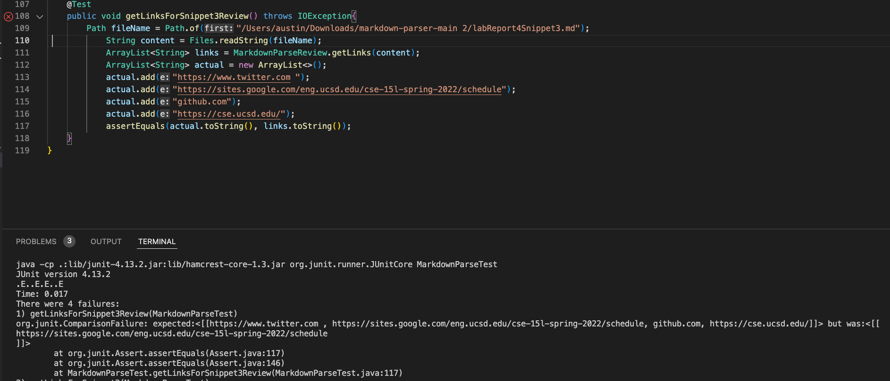

### Questions to answer
#### Do you think there is a small (<10 lines) code change that will make your program work for snippet 1 and all related cases that use inline code with backticks? If yes, describe the code change. If not, describe why it would be a more involved change.
Both of our implementations of markdownparse worked properly for the first markdown file. Because of this, we do not need to add anything in the code for this first snippet.
#### Do you think there is a small (<10 lines) code change that will make your program work for snippet 2 and all related cases that nest parentheses, brackets, and escaped brackets? If yes, describe the code change. If not, describe why it would be a more involved change.
I think that I can change the program in under 10 lines to make it work for snippet 2. I think what I would have to do is check after the first close parenthesis to make sure that it is the only close parenthesis. As of now, I only have it check for the first one, and then call it a day, but I have to make it so it goes to the next link after the final close parenthesis.
#### Do you think there is a small (<10 lines) code change that will make your program work for snippet 3 and all related cases that have newlines in brackets and parentheses? If yes, describe the code change. If not, describe why it would be a more involved change.
I do not think I can change this program in under 10 lines for it to work for snippet 3. For the first link, it looks relatively simple, but for the last link, I am not sure as to why it takes in a whole block of text. Also, the fact that I have to change two things to make the actual the same as expected instead of just one will make me have to write more lines, which would make it more complex.