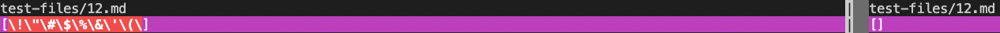
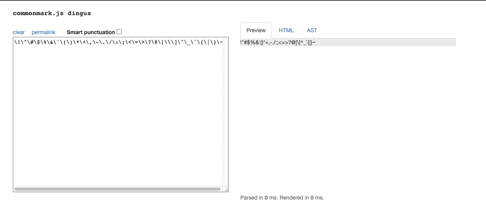
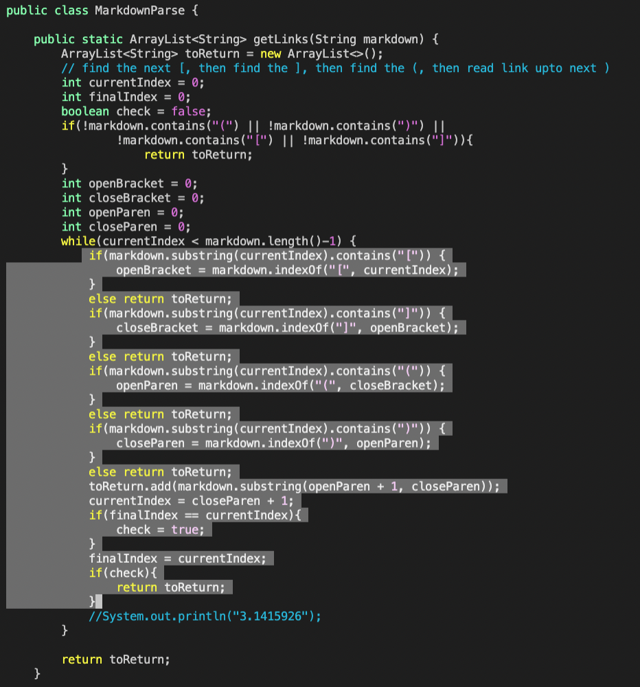
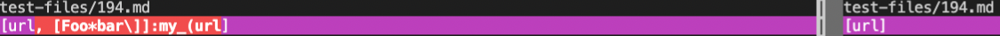
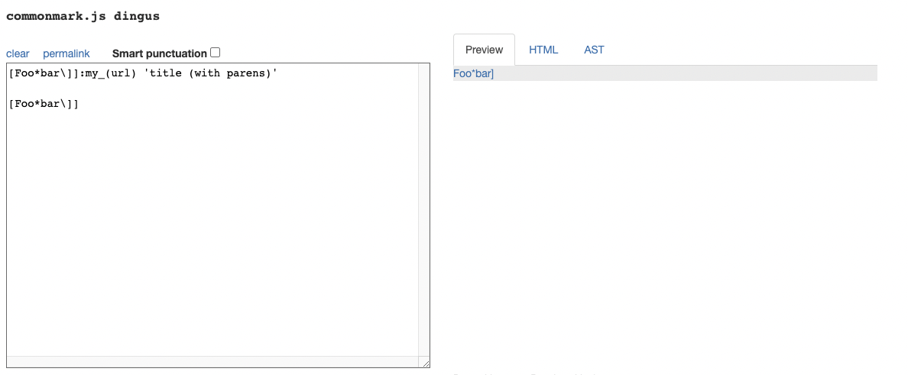
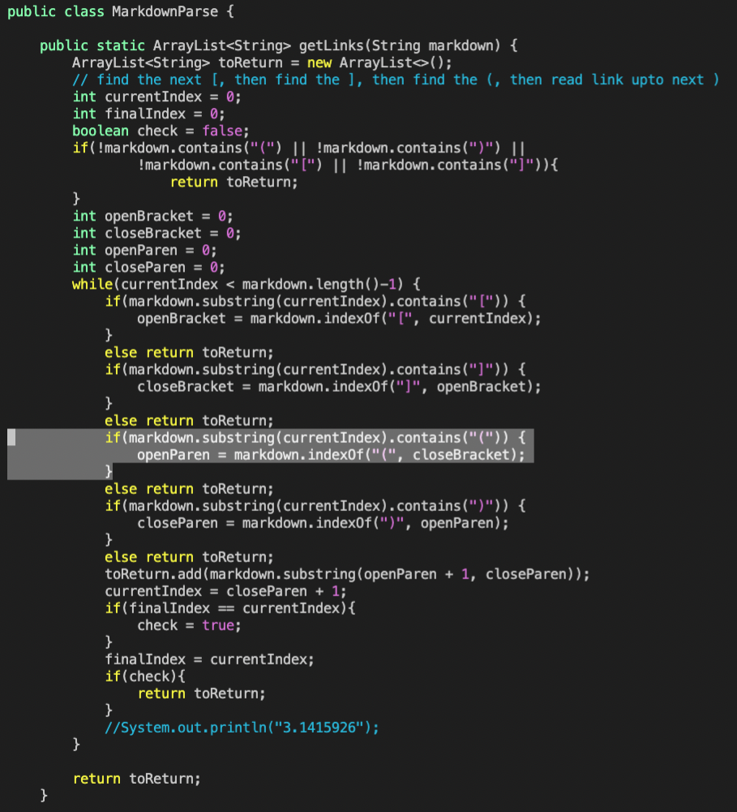

# Week 10 Lab Report (5)
### How you found the tests with different results (Did you use vimdiff on the results of running a bash for loop? Did you search through manually? Did you use some other programmatic idea?)
I used vimdiff. The full line of code was as follows:
```
$ vimdiff markdownparse/results.txt cse15lsp22-markdown-parser/results.txt
```
Afterwards, I just scrolled through until I found one that was differing. 

### Fix Number One
The first one I'm attempting to fix is test number 12. 
[Here](https://github.com/nidhidhamnani/markdown-parser/blob/main/test-files/12.md) is the link to the test-file 12.
The implementation given to us is correct, while my implementation is the incorrect one.
Here is the difference found using vimdiff:

There should be no links linked, yet mine gives a bunch of characters.
[The CommonMark Demo Website](https://spec.commonmark.org/dingus/) shows us this as the preview for the test:


Here is my code with the bug:


So the problem with my code is that it should be updating current index every time it goes into an if statement. This way, the substring the indexOf will work properly and I will get proper links instead of all of the random characters in between. Then it will know that there aren't any parenthesis AFTER the brackets. This is why the entire while loop section was highlighted.

### Fix Number Two
The next one I'm attempting to fix is test number 194. 
[Here](https://github.com/nidhidhamnani/markdown-parser/blob/main/test-files/194.md) is the link to the test-file 194.
Both implementations are incorrect.
Here is the difference found using vimdiff:

There should be no links linked, yet mine gives two "links" and the one given to us gives one.
[The CommonMark Demo Website](https://spec.commonmark.org/dingus/) shows us this as the preview for the test:


Here is my code with the bug:


So the problem with my code is that it should be checking to see if the parenthesis starts immediately after the bracket. Instead, it checks to see if there is one after the bracket. What it should do is skip everything else if it doesn't directly follow it. That ways, it will only pick up "links" that are properly formatted.

